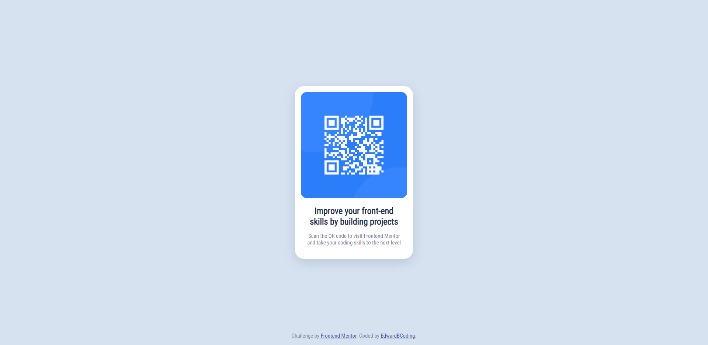

# Frontend Mentor - QR code component solution

This is my solution to the [QR code component challenge on Frontend Mentor](https://www.frontendmentor.io/challenges/qr-code-component-iux_sIO_H).

## Table of contents

- [Overview](#overview)
  - [Screenshot](#screenshot)
  - [Links](#links)
- [My process](#my-process)
  - [Built with](#built-with)
  - [What I learned](#what-i-learned)
  - [Continued development](#continued-development)
  - [Useful resources](#useful-resources)
- [Author](#author)
- [Acknowledgments](#acknowledgments)

## Overview

### Screenshot

### Links

- Solution URL: [Here](https://www.frontendmentor.io/solutions/qr-code-component-R-99Nhwzu9)
- Live Site URL: [Here](https://edwardbcoding.github.io/QR-Code-Page/)

## My process

### Built with

- HTML
- CSS
- CSS Variables
- CSS Flexbox

### What I learned

Through this project I practiced using Variables to keep my colors organized. I solidified some knowledge on flexbox, padding and margins and how to manipulate them. I grew to appreciate box shadow and its nuances in spread vs blur.

### Continued development

In future projects, I want to become more comfortable with moving objects around more than just centering as well as wanting to learn more in terms of responsiveness. I would also like a better control of my flex boxes and whats inside (text sticking out of the box, image taking up the whole area, etc.).

### Useful resources

- [Google](https://www.google.com/) - Because who can do anything without google.
- [GitHub Pages](https://docs.github.com/en/pages/getting-started-with-github-pages/creating-a-github-pages-site#creating-your-site) - Through this project I also learned how to manage and host a page through GitHub Pages.
- [MDN Web Docs](https://developer.mozilla.org/en-US/docs/Web/CSS/bottom) - This helped me with moving an object besides just centering it. I used this for the text at the bottom of the screen.
- [Stack Overflow](https://stackoverflow.com/questions/24254127/html-image-wont-display) - I had an issue with linking the QR image. Turns out theres a difference of absolute vs relative location which this helped me understand

## Author

- GitHub - [@EdwardBCoding](https://github.com/EdwardBCoding)
- Frontend Mentor - [@EdwardBCoding](https://www.frontendmentor.io/profile/EdwardBCoding)

## Acknowledgments

Thanks to the team over at Frontend Mentor! Having a project to clone like this was very useful!

